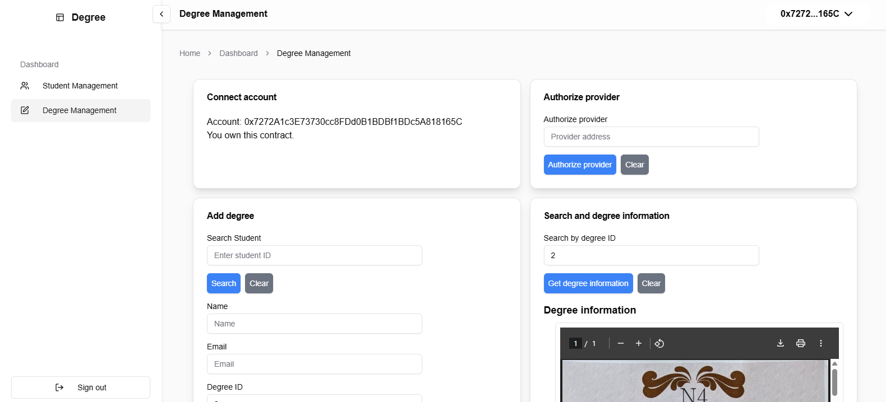
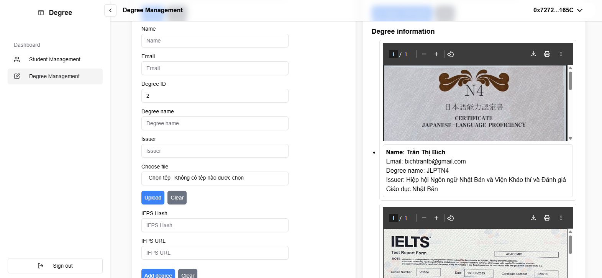
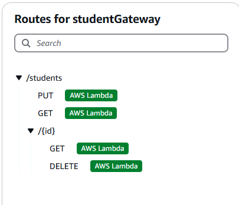
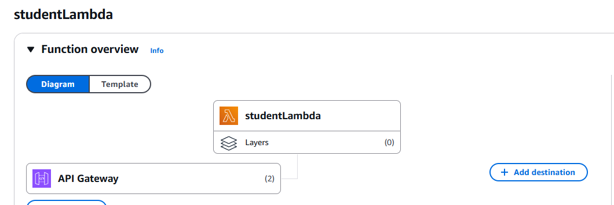
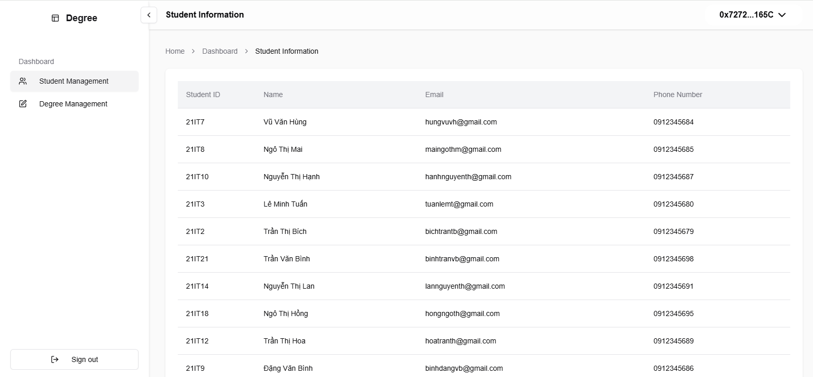

# Blockchain Degree Management

This project is a blockchain-based degree management system that allows authorized providers to add and manage degrees. The system uses a smart contract deployed on the blockchain to ensure the integrity and authenticity of the degree records.

## Project Images

### **Main Dashboard - Degree Management Interface**


### **Degree View - Viewing Degree Details**


### **AWS API Gateway - Connecting Application with AWS Lambda**


### **AWS Lambda - Processing Student Records on DynamoDB**


### **Student API - Fetching Student Records**


## Getting Started

### Prerequisites
Make sure you have the following installed on your machine:

- [Node.js](https://nodejs.org/) (version 14.x or later)
- [pnpm](https://pnpm.io/)

### Installation

1. Install `pnpm` if you haven't already:
   ```bash
   npm install -g pnpm
   ```
2. Clone the repository and install dependencies:
   ```bash
   git clone https://github.com/your-username/blockchain-degree-management.git
   cd blockchain-degree-management
   pnpm install
   ```

### Environment Variables

Create a `.env.local` file in the root directory and add the following variables:

```bash
# .env.local
PINATA_JWT=your_pinata_jwt
NEXT_PUBLIC_GATEWAY_URL=your_gateway_url
NEXT_PUBLIC_API_URL=your_api_url
CONTRACT_ADDRESS=your_contract_address
CONTRACT_ADDRESS_2=your_contract_address_2
```

Replace `your_*` values with actual configuration details.

## Running the Application

### Development Mode
```bash
pnpm dev
```
Open [http://localhost:3000](http://localhost:3000) in your browser.

### Production Mode
Build and start the project:
```bash
pnpm build
pnpm start
```

## Usage Guide

1️⃣ **Connect Wallet**: Click "Connect Wallet" to authenticate with your blockchain wallet.

2️⃣ **Authorize Provider** (Admin Only): Enter provider address and click "Authorize Provider".

3️⃣ **Add Degree**:
   - Enter degree details
   - Upload the degree file
   - Click "Add Degree"

4️⃣ **Search Degree**:
   - Enter degree ID
   - Click "Search Degree" to fetch degree details

## API Endpoints

- **Fetch Students**:
  ```bash
  GET ${process.env.NEXT_PUBLIC_API_URL}/student
  ```
- **Fetch Degree Records**:
  ```bash
  GET ${process.env.NEXT_PUBLIC_API_URL}/degree/{degreeId}
  ```
- **Upload File to Pinata**:
  ```bash
  POST https://api.pinata.cloud/pinning/pinFileToIPFS
  ```

## Updating ABI and Contract Address

1. **Update ABI**: Replace contents of `contractABI.json` with the new ABI.
   ```json
   // ./src/app/(dashboard)/degree/contractABI.json
   {
     "abi": [
       // ...new ABI content...
     ]
   }
   ```
2. **Update Contract Address**: Modify `degree.tsx`.
   ```tsx
   // ./src/app/(dashboard)/degree/degree.tsx
   const contractAddress = process.env.CONTRACT_ADDRESS;
   ```

## AWS Lambda Function

The `awsLambda/index.mjs` file contains the code for the AWS Lambda function that interacts with the DynamoDB table to manage student records. The Lambda function supports the following operations:

1. **Get Student by ID**: Fetch a student record by its ID.
2. **Get All Students**: Fetch all student records.
3. **Add/Update Student**: Add a new student record or update an existing one.
4. **Delete Student**: Delete a student record by its ID.

## Contributing

Contributions are welcome! Please open an issue or submit a pull request.

## License

This project is licensed under the MIT License. See the [LICENSE](LICENSE) file for details.